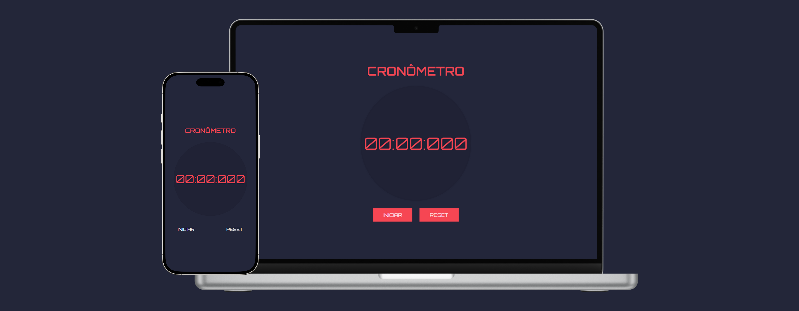

# Cronômetro

Este é um projeto simples de cronômetro desenvolvido com HTML, CSS e JavaScript. O cronômetro permite iniciar, pausar, continuar e resetar a contagem do tempo. **[Link do projeto](https://davirrocha.github.io/cronometro/)**

## Tecnologias Utilizadas

- HTML

- CSS

- JavaScript

## Funcionalidades

- Iniciar: Começa a contagem do tempo.

- Pausar: Interrompe temporariamente a contagem.

- Continuar: Retoma a contagem do tempo a partir da pausa.

- Resetar: Reinicia o cronômetro para 00:00:000.